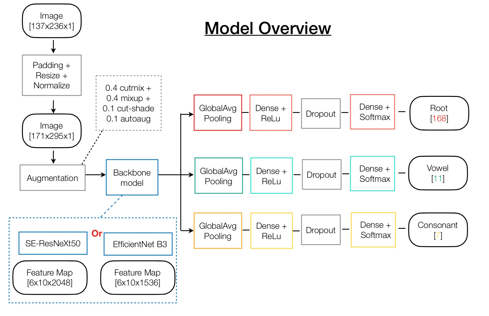

# Bengali.AI Handwritten Grapheme Classification

Classify the components of handwritten Bengali. This is a kaggle competition hosted from 2019-12-20 to 2020-03-16. Link to the competition page [Kaggle Bengali.AI](https://www.kaggle.com/c/bengaliai-cv19/overview).

This project won a bronze medal with a ranking of 171/2059 in the competition  (top 9%). 

Author: Jingjie Zhang (jjzhang369@gmail.com); Mingda Zhu (mdzhu.pku@gmail.com)

# Table of Contents

*   [Solution Overview](##solution-overview)
*   [Directory Layout](#directory-layout)
*   [Installation](#installation)
    *   [Download the data](#download-data)
    *   [Install the Requirements](#requirements)
*   [Usage](#usage)
    *   [Training](#training)
    *   [Inference](#inference)
*   [Extending this](#extend)


# Solution Overview
-----

The solution is an ensemble model with backbone of [EfficientNet B3](https://github.com/qubvel/efficientnet) and [Seresnext50](https://github.com/qubvel/classification_models). 
<br>
<div align="center">
  
</div>

# Directory Layout
-----

```
.
|--- input
|      |--- train or test parquet and csv files # train and test files provided by the competition (https://www.kaggle.com/c/bengaliai-cv19/data)
|      |--- train                               # folder for preprocessed training image files
|      |--- test                                # folder for preprocessed testing image files 
|--- output                                     # folder for saving the submission.csv 
|--- model                                      # folder for trained weights 
└--- src                                        # scripts
```

# Installation 
-----

## Download the data
* Clone this repo to your local computer 
* Download the data from the kaggle Bengali.AI competition page [here](https://www.kaggle.com/c/bengaliai-cv19/data).
                         
